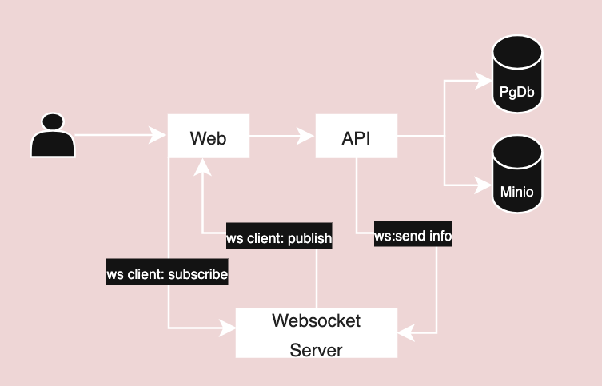

# Image Gallery

## Setup

 File `api.rest` is defined with API endpoints and to effecticely utilise need vscode extension [REST Client](https://marketplace.visualstudio.com/items?itemName=humao).
 
Please follow the bellow steps to run the application. 

* Run `source ./init_env.sh` to sent `env` variables. Please run in every terminal lof API, Web and websocket. 
* In `/src` run `docker compose up -d --no-recreate` to setup postgreSQL and Minio.
* In `/src` run `goose up` to run database migrations.
* In `/src/websocket` run `go run ./*.go` to start websocket server.
* In `/src/backend` run `go run ./api/*.go` to start the api.
* Run `feed.sh` to initailise Gallery with images. 
* In `/src/frontend/web-app` run `npm run dev` to start the web application.

********NOTE: `Websocket` server should be initialised before `web-app` instantiated 
## Design decisions

### Aim

* Clean Architecture:
    - Followed to certain extend clean architecture best practice, guid to scallable and maintainable application. 
* Maintanable code:
    - **SQLC** and **Goose**: Allow us to easlily manage our database overhead adhearing to previous point.
* Loose coupling:
    - Seperatig relational database, **PostgreSQL**,  with the object store, **MinIo**, allow is to scale and manage the application store. *Though it might be avoided in certain instance like small or less popular aplication*
* Testable code:
    - This is an area of improvement.

### Application design 
Following is the current design. 

Following are some of the components considered for the image gallery application. 
* **PostgreSQL** is the choice of the database. It is relaiable DB in a way images can also be efficantly stored.
* **MinIo** It is scalable object store and loosely couples the system design. 
* **Websocket Server** Although I can have webserver running as part of the API process.A seperate webbserver will allow decouple the two process. 
* **Web** Accept user input to add images to gallery and search by tag. It subscribes to `ws` for near realtime update. 
* **API** resize the image and stores images in datastores. It publish image info to `ws` to reflect same on UI. 

### Areas of improvement
In my opinion many things can be improved and foollowing are few identified . 
* Unit/integration tests
* Effeciant use of `.env` file. This hindered in creating docker images.
    - WIP to remove dependency.
* Implementing Bonus section.

### Downside
Early choice of using Object store forced us to use `img` html tag rather efficiant `Image`, a react component. `Image` needs to be served by the server with proper `cors` permissions. Unfortuantly **MinIo** had certail limitations.   
